# FJones Personal training

## Introduction

The primary goal of this webpage is to serve as a platform for my friend's business. Currently, my friend does not have a website and relies on word-of-mouth to build his client base. This site aims to offer an engaging and informative introduction to his experience, training philosophy and what he can offer. It will also provide details about one-on-one training sessions, group training, nutritional guidance and customised workout plans. Additionally, the webpage will feature a booking system and accessible contact options, making it easier for the potential clients to reach out, ask questions, and schedule consultations. This will hopefully bring in new business and target people from any training level that want to improve their strength or fitness.

Link to [responsive Mockup](https://ui.dev/amiresponsive?url=https://davidrc-projects.github.io/Fjones-Personal-Training/)

## CONTENTS

[User Experience]
[User Stories]

[Features]

[Design]

- Colour scheme
- Typography
- Wireframes

## User Experience (UX)

### User Stories

#### First Time Visitor Goals

- I want to be able to learn about the personal trainers experience and what they offer so that i can assess their expertise and find the right trainer for me.
- I want to view testimonials to gauge the effectiveness of the personal trainer.
- I want to see a list of availiable services and pricing to work out my budget.
- I want to be able to view the trainers social media links to learn more about their sessions and training philosophy.
- I want a user-friendly layout so i can find information quickly and is responsive to different screen sizes.

#### Returning Visitor Goals

- Upon returning to the site i would like access to workout and nutrition plans.
- I would like to be able to book a session and contact the trainer.

#### Frequent Visitor Goals

- I would like to be able to rechedule my bookings online and be able to do this quickly without having to navigate through many pages.
- I want to access a schedule overview to check upcoming sessions at a glace.
- I would like to have access to personalised feedback from sessions.

#### Owner Goals

- To increase the number of new clients and retension of existing clients by offering online services that are accessable and easy to use from any device.
- To increase awareness of his brand by establishing a strong online presence by increasing visibility on search engines that will highlight his experience.
- The webpage will make administrive tasks easier by using an automated system that will organise time slots from his clients and make it easier to track payments as currently uses a paper diary to record this.

## Design

### Colour Scheme

I used a colour image picker to select colours from the logo, ensuring consistent colour usage across the webpage. To create visually appealing design, i chose a dark background, accented with purple to highlight specific elements. The use of purple can help reinforce brand identity and can make key components stand out to engage users. Initially i created a logo for the website, however i made a conscious descision that actual images of the trainer would be more engaging and add familiarity for the users. Therefore, despite this the colours stayed consistent throughout the webpages with CSS variables used to make it easier to change in the future.

I have used the following Hex colours:

#ffffff;
#000000;
#380b72;
#7A0BEA;
#bcbcbc;

### Typography

I have used google fonts to import fonts.

The primary font that was used for the h1 headings was Marvel font. From my research of fonts i felt this looked sharp and had modern feel to it and preferred this to other fonts. An advantage to using this font is that is a sans serif typeface making it more legible.

I used Montserrat as my secondary font. I researched on google good fonts for readability and consciously decided this was the most appealing font to go along side the marvel font.

### Wireframes

Wireframes were created for desktops, tablet and mobile using figma.

### Home page (index.html)

### Aboutme page (aboutme.html)

### Booking page (booking.html)

### Testimonials page (testimonial.html)

### Contact page (contact.html)

## Existing Features

The website is designed to offer a seamless experience through the following pages:

- Home Page: This is the starting point where new clients or existing clients can have an overview of what the trainer offers and availiability.

- About Me Page: This page gives a deeper dive into the trainers expereince and why the user should choose his services.

- Booking Page: This page has been developed for enquires and to send a date and time the user would like to book an appointment.

- Contact Page: This page was developed for the user to reach out for any enquiries.

- Booking confirmation pages: This was developed for the booking form and feedback form to indicate to the user that their request has been submitted.

- Error 404 page: This was added incase the page is not able to load or has been deleted and sends the user back to the homepage.

- Favicon and title

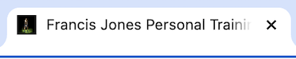

- Header and navigation bar

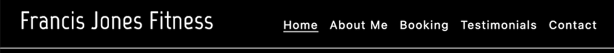
The header includes a h1 element that links back to the homepage.
The navigation bar stays in a fixed position on the screen and has the text underlined when your on a particular page. The navigation bar will also change colour as you hover over each option. This is also responsive to different screen sizes and will turn into an icon on mobile devices, in which the options will drop down in a list.

Navbar icon for mobile device

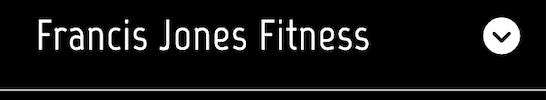

Navbar dropdown for mobile device

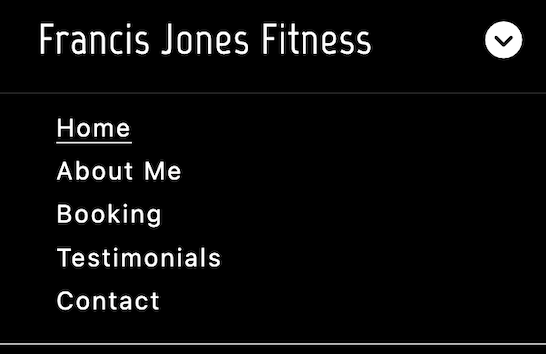

- Footer

The footer maintains a consistent colour with icons that enlarge when you hover over them. Each footer icon has a link to the corresponding social media site. It is responsive to all device sizes.

- Home page

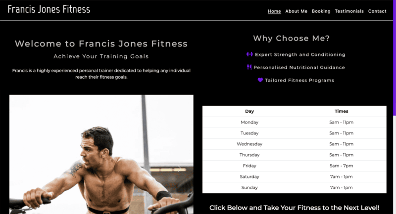

The home page is divided into two responsive containers that adapt to all screen sizes. I used a Bootstrap carousel with 2 images and a table of his availiability that adjusts dynamically, displaying as a single column on mobile devices and two columns on desktop screens and larger. The second container features cards with images showcasing the trainer's offerings. Additionally, an h2 heading presents a welcome message, accompanied by text in a paragraph designed to inspire and highlight the site's purpose. Under the table there is a "Book Now" button that has a link for the user to go to booking page.

- About me page

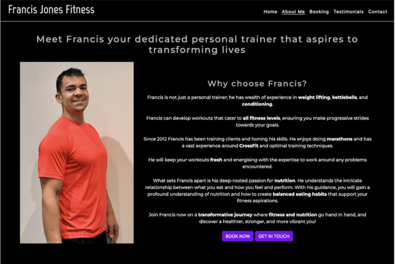

The About Me page follows a similar format to the homepage, featuring a container that splits into two columns. One column displays a picture of Francis, the trainer, while the other highlights reasons to choose Francis, using spans to emphasize key words. Below this, buttons are styled in CSS to match those on the homepage. The "Book Now" button links to the booking page, while the "Get in Touch" button directs users to the contact page.

The second container includes three cards that is the same as the homepage. The layout is fully responsive, adjusting to a single column on mobile devices and three columns on larger screens for optimal readability.

- Booking and testimonial pages

Booking page

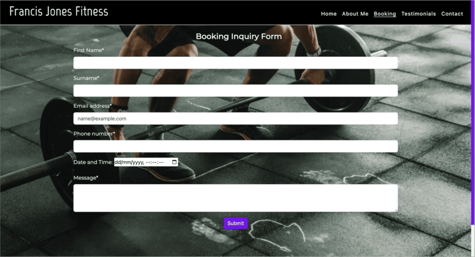

The booking inquiry page will allow the user to submit their details and request a specific date and time for their first session. This page includes a textarea for the user to leave a message and a submit button that takes the user to another page upon submission. I have used bootstrap 5 to provide a responsive layout and an image in the background to make the page more engaging and enhance the user experience.

 Please see the booking success page below:

Booking success page

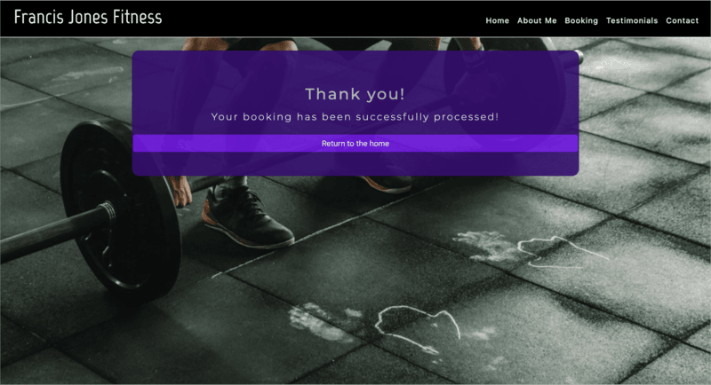

Testimonials page

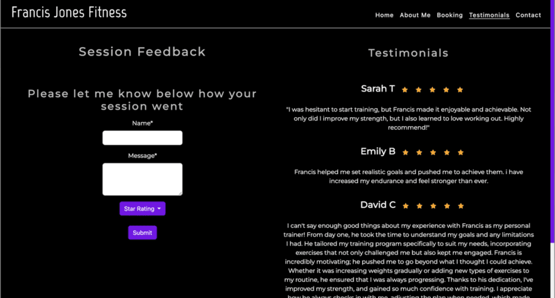

This page has been developed using bootstrap 5 and will help the user provide feedback on their training sessions with a textarea and a star rating. On desktop and larger the screen splits into 2 columns. The left section of the page has a feedback form and a drop down menu down menu to provide the star rating. There is a submit button below that takes the user to a feedback success page to let the user know their feedback has been submitted. Please see an example below. The right side of the page displays testimonials provided from his clients with his star ratings. On smaller screens like mobile devices the screen adjusts to one column with the input fields at the top of the page and testimonials at the bottom.

- Contact page

This page will provide the user the necessary information to locate the gym and multiple options for getting in touch with the trainer. The page has been developed with a responsive bootstrap 5 layout. I have placed headings to guide the user and embedded a google map that includes the location of the gym and is resposive to different screen sizes. Below the google map i have used icons from font awesome to give the user 3 options to contact the trainer. This makes it visually easier and more accessable for the user the identify how they want to contact the trainer. The 'Contact Me' section is split into 3 columns on desktop and larger screens and stack ontop of eachother when in smaller screens. 

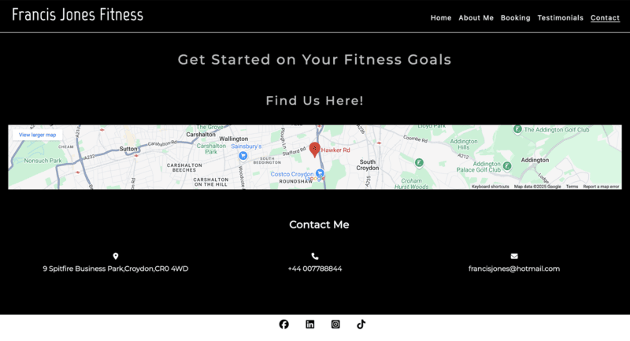

  embedded Google maps (researched on google and found option to embed code into my work as the url link was blocked)

## Accessibility

### General Site Strucutre

All pages have a favicon item, title of 'Francis Jones Personal Training' and a h1 element of 'Francis Jones Fitness' that links every page with an anchor element back to the home page. There is a navigation bar and footer on each page that includes anchor elements to navigate the website and access his social media links respectively. Each page of the website has an accessibility rating of 94-100.

### Buttons

All buttons throughout the site maintain a consistent design and hover effect to improve the user experience. The buttons are styled using CSS and bootstrap 5. The buttons all have a hover effect using variables to change the colour from purple to white, indicating to the user they are hovering over the button.

### Custom scroll bar

I have added a customised scroll bar that changes colour from purple to dark purple when the user hovers over to interact with the bar. This bar stays consistent with he colours used through the sites design.

### Hover effects

To improve user interaction the icons across the site i have implemented a hover effect that increases in size when hovered over. Also to maintain a consistent style, all buttons across the site have the same background colour that changes as you hover over.

### Error 404 page

The site includes a custom 404 error page to enhance user experience when a page doesn't exist anymore or is broken. This contains a message telling the user that the page cannot be loaded or doesn't exist with a button to give them the option to return to the homepage. This uses a background image used in the booking page and consistent colours with the other webpages. Bootstrap has been used to create a card that has been used in both the booking success and feedback success pages.

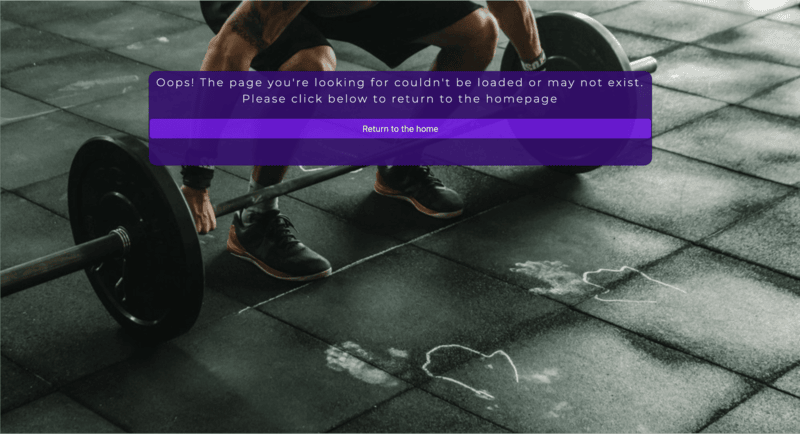

### Colour contrast improvements

A contrast checker was used to ensure the text was readable on the background. The original hex code #7A0BEA (purple) used in the spoan elements on the About Me page had a low contrast rating (3.06) and was replaced with #FFFFFF (white) to improve its readbility.

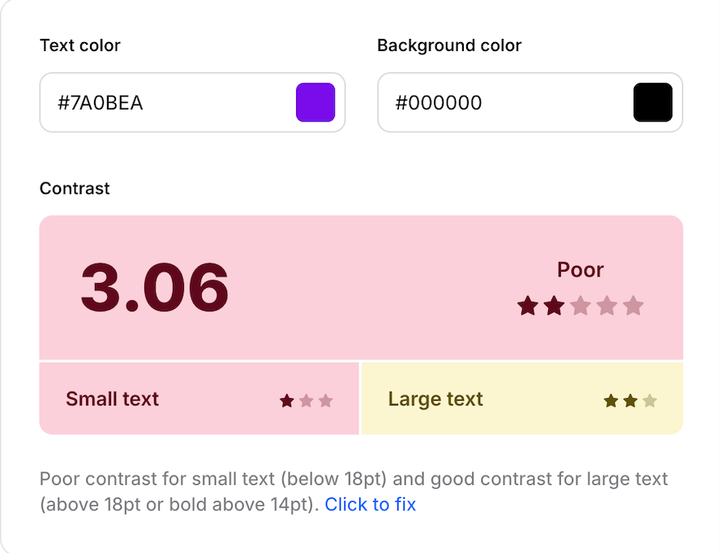 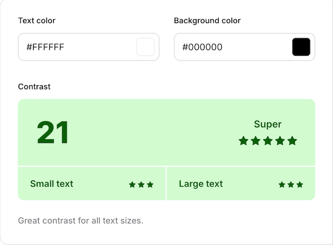

## Future implementations

1. Booking form
- Add a caldendar feature that allows users to select and save availiable training session dates.
- Ensure live calendar visibility for both the user and trainer, providing a better user experience.
- Add a payment option for booking sessions directly through the website.
- Include a pricing list below the booking form to display availiable services and their costs. 

2. Core training area cards and blog page
 - Make the core training area cards in the home and about me pages clickable with a hyperlink.
 - Each card will like to blog pages providing detailed advice on kettlebell training, strength training and nutritional coaching. This will help give the user more understanding of the level of coaching and advice they will receive and to improve their own knowledge and options aviliable from the trainer.

3. Star rating and testimonials update
- Autumatically update the testimonials page with client-submitted feedback and their star ratings.
- Add a testimonial carousel for better readability and a smoother user experience.
- Place the testimonial carousel on the homepage below the core training sections and add a "leave feedback" button below the carousel. This will hopefully improve user engagement for returning users.

4. Configure server so that the custom 404 page appears when a link is broken

## Testing

### Manual testing

#### Responsiveness testing

- Used the inspect element tool in Google Chrome to check different screen sizes (mobile, tablet, desktop and larger screens).
- Ensured all webpages adapt properly to different screen widths.

#### Navigation and link testing

- Verified that all navigation links direct users to the correct pages.
- Tested the h1 element, navigation bar, buttons, and social media icons to confirm they link to there respective pages.

#### Hover effects and User interaction
- Checked hover effects on:
- h1 element
- Navigation bar
- Tables
- Icons
- Buttons
- Social media links

#### Form Validation and Redirection
- Tested the booking enquiry and feedback forms to confirm they:
- Redirect users to the correct successpage after submission.
- Display validation messages when required fields (marked with an asterisk) are left empty.
- Prevent submission of inputs containing only whitespace.

Validation check

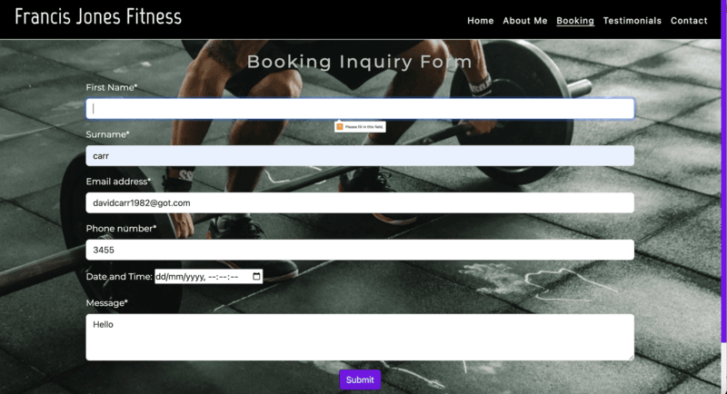

#### Layout and UI fixes
- Identified and resolved an issue where the h1 element had a line break on every page expect the index page.

Home page testing
| Feature | Testing Performed | Result | Pass/Fail |
| --- | --- | --- | --- |
| Site title | Hover over navbar | Changes colour on hover | Pass |
| Navbar home button | Hover over navbar | Changes colour on hover with home underlined to show user the page they are on | Pass |
| Navbar about me button | Hover over navbar and click | Changes colour on hover and takes user to about me page | Pass |
| Navbar booking button | Hover over navbar and click  | Changes colour on hover and takes user to booking page | Pass |
| Navbar tesimonials button | Hover over navbar and click  | Changes colour on hover and takes user to testimonials page | Pass |
| Navbar contact button| Hover over navbar and click  | Changes colour on hover and takes user to contact page | Pass |
| Navbar button drop down | Change screen size to mobile | Navbar turns into a drop down icon on mobile devices and smaller | Pass |
| Day and Time table | Hover over table list | table rows highlight grey on hover  | Pass |
| Book now button | Click button | redirects user to booking page | Pass |
| Footer icons | Click each footer icon | Hover effect on each icon and when clicked takes the client to the appropriate link | Pass |
| Carousel next and previous buttons | Click on next and previous button on the automatic carousel  | Slides to next image | Pass |

About me page testing
| Feature | Testing Performed | Result | Pass/Fail |
| --- | --- | --- | --- |
| Site title | Hover over navbar and click on title | Changes colour on hover and takes the client to the home page when clicked on | Pass |
| Navbar home button | Hover over navbar | Changes colour on hover with home underlined to show user the page they are on | Pass |
| Navbar about me button | Hover over navbar and click | Changes colour on hover and takes user to about me page | Pass |
| Navbar booking button | Hover over navbar and click  | Changes colour on hover and takes user to booking page | Pass |
| Navbar tesimonials button | Hover over navbar and click  | Changes colour on hover and takes user to testimonials page | Pass |
| Navbar contact button| Hover over navbar and click  | Changes colour on hover and takes user to contact page | Pass |
| Navbar button drop down | Change screen size to mobile | Navbar turns into a drop down icon on mobile devices and smaller | Pass |
| Footer icons | Click each footer icon | Hover effect on each icon and when clicked takes the client to the appropriate link | Pass |
| Book now button | Click button | redirects user to booking page | Pass |
| Get in Touch button | Click button | redirects user to contact page | Pass |

Booking page testing
| Feature | Testing Performed | Result | Pass/Fail |
| --- | --- | --- | --- |
| Site title | Hover over navbar | Changes colour on hover | Pass |
| Navbar home button | Hover over navbar | Changes colour on hover with home underlined to show user the page they are on | Pass |
| Navbar about me button | Hover over navbar and click | Changes colour on hover and takes user to about me page | Pass |
| Navbar booking button | Hover over navbar and click  | Changes colour on hover and takes user to booking page | Pass |
| Navbar tesimonials button | Hover over navbar and click  | Changes colour on hover and takes user to testimonials page | Pass |
| Navbar contact button| Hover over navbar and click  | Changes colour on hover and takes user to contact page | Pass |
| Navbar button drop down | Change screen size to mobile | Navbar turns into a drop down icon on mobile devices and smaller | Pass |
| Footer icons | Click each footer icon | Hover effect on each icon and when clicked takes the client to the appropriate link | Pass |
| First name input field | Add white space and then no text into field | Message appears to fill in field on submit or match the format request if white space | Pass |
| Surname name input field | Add white space and then no text into field | Message appears to fill in field on submit or match the format request if white space | Pass |
| Email input field | Add white space and then text without @ into field | Message appears to include '@' in email address on submit or fill in this page if white space | Pass |
| Phone number input field |Add white space and then no text into field | Message appears to fill in field on submit | Pass |
| Date and time input field | Inserted date and time | Date and time shown after using calendar | Pass |
| Message input field | No text added | Message appears to fill in field on submit | Pass |
| Submit button | Click button | redirects user to booking success page | Pass |

Testimonials page testing
| Feature | Testing Performed | Result | Pass/Fail |
| --- | --- | --- | --- |
| Site title | Hover over navbar | Changes colour on hover | Pass |
| Navbar home button | Hover over navbar | Changes colour on hover with home underlined to show user the page they are on | Pass |
| Navbar about me button | Hover over navbar and click | Changes colour on hover and takes user to about me page | Pass |
| Navbar booking button | Hover over navbar and click  | Changes colour on hover and takes user to booking page | Pass |
| Navbar tesimonials button | Hover over navbar and click  | Changes colour on hover and takes user to testimonials page | Pass |
| Navbar contact button| Hover over navbar and click  | Changes colour on hover and takes user to contact page | Pass |
| Navbar button drop down | Change screen size to mobile | Navbar turns into a drop down icon on mobile devices and smaller | Pass |
| Footer icons | Click each footer icon | Hover effect on each icon and when clicked takes the client to the appropriate link | Pass |
| Name input field | Add white space and then no text into field | Message appears to fill in field on submit or match the format request if white space | Pass |
| Message input field | No text added | Message appears to fill in field on submit | Pass |
| Submit button | Click button | redirects user to feedback success page | Pass |

Contact page testing
| Feature | Testing Performed | Result | Pass/Fail |
| --- | --- | --- | --- |
| Site title | Hover over navbar | Changes colour on hover | Pass |
| Navbar home button | Hover over navbar | Changes colour on hover with home underlined to show user the page they are on | Pass |
| Navbar about me button | Hover over navbar and click | Changes colour on hover and takes user to about me page | Pass |
| Navbar booking button | Hover over navbar and click  | Changes colour on hover and takes user to booking page | Pass |
| Navbar tesimonials button | Hover over navbar and click  | Changes colour on hover and takes user to testimonials page | Pass |
| Navbar contact button| Hover over navbar and click  | Changes colour on hover and takes user to contact page | Pass |
| Navbar button drop down | Change screen size to mobile | Navbar turns into a drop down icon on mobile devices and smaller | Pass |
| Contact me icons | Click each icon | Hover effect on each icon | Pass |
| Footer icons | Click each footer icon | Hover effect on each icon and when clicked takes the client to the appropriate link | Pass |
| Map | Click on map and move the map by holiding right click | Able to zoon in and out of map and move map within the iframe | Pass |

Booking success page testing
| Feature | Testing Performed | Result | Pass/Fail |
| --- | --- | --- | --- |
| Site title | Hover over navbar | Changes colour on hover | Pass |
| Navbar home button | Hover over navbar | Changes colour on hover with home underlined to show user the page they are on | Pass |
| Navbar about me button | Hover over navbar and click | Changes colour on hover and takes user to about me page | Pass |
| Navbar booking button | Hover over navbar and click  | Changes colour on hover and takes user to booking page | Pass |
| Navbar tesimonials button | Hover over navbar and click  | Changes colour on hover and takes user to testimonials page | Pass |
| Navbar contact button| Hover over navbar and click  | Changes colour on hover and takes user to contact page | Pass |
| Navbar button drop down | Change screen size to mobile | Navbar turns into a drop down icon on mobile devices and smaller | Pass |
| Return home button | Click button | redirects user to home page | Pass |

Feedback success page testing
| Feature | Testing Performed | Result | Pass/Fail |
| --- | --- | --- | --- |
| Site title | Hover over navbar | Changes colour on hover | Pass |
| Navbar home button | Hover over navbar | Changes colour on hover with home underlined to show user the page they are on | Pass |
| Navbar about me button | Hover over navbar and click | Changes colour on hover and takes user to about me page | Pass |
| Navbar booking button | Hover over navbar and click  | Changes colour on hover and takes user to booking page | Pass |
| Navbar tesimonials button | Hover over navbar and click  | Changes colour on hover and takes user to testimonials page | Pass |
| Navbar contact button| Hover over navbar and click  | Changes colour on hover and takes user to contact page | Pass |
| Navbar button drop down | Change screen size to mobile | Navbar turns into a drop down icon on mobile devices and smaller | Pass |
| Return home button | Click button | redirects user to home page | Pass |

404 page testing
| --- | --- | --- | --- |
| Return home button | Click button | redirects user to home page | Pass |

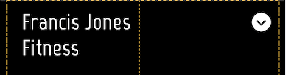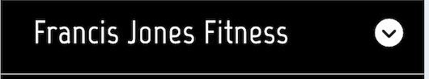

### Automated Testing

I used Lighthouse in Google Chrome DevTools to analyse my website's performance, accessibility and best practices.

#### Identified issues and fixes

Homepage

1. Image Resolution (Performance - 97%)
The first image on the carousel could have had a better resolution to improve the best practice score. However, this image was provided by the trainer, and I was unable to obtain a higher-resolution version thus not fixing this issue.

2. List with Icons (Accessibility - 94%)
There were line break affecting the screen reader accessibility, therefore i adjusted this by removing the line breaks and adding padding around these elements.

3. Heading Hierarchy (Accessibility - 94%)
The heading strcuture for the Core Training Areas section was incorrect. I changed these elements from h2 to h4 to follow the correct order.

The overall outcome after fixes were 100% Best Practice, 100% Accessibility and 97% Performance.

About me page

1. Cumulative Layout Shift (CLS) Issue
This page had a CLS of 0.134s, exceeding the recomended 0.1s. The following fixes were attempted:
I reduced the word count on the h2 element that lowered the CLS to 0.127s. I then moved the H2 element above the section container and further reduced this to 0.113s. I finally edited the paragrpah content that was still highlighting an issue. Despite this the CLS remained unchanged at 0.113s. 

The CLS issue persisted due to an unknown cause related to the paragraph 'what sets Francis apart is his deep-rooted passion for nutrition'. While diferent solutions were tested, the exact reason for this paragraph contributing to the CLS could not be identified. Therefore, further investigation is needed to find the root cause. 

2. Heading Hierarchy (Accessibility - 98%)
The heading strcuture for the Core Training Areas section was incorrect. I changed these elements from h2 to h4 to follow the correct order.

The overall outcome after fixes were 100% Best Practice, 100% Accessibility and 94% Performance.

Booking page

This page had 100% on Best Practice, Accessibility and Performance.

Testimonials page
1. Heading Hierarchy (Accessibility - 98%)
The heading strucuture did not follow a semantic order, which lowered the accessibility. The title 'Testimonials' was originally an h2 element, but changing it to an h3 element corrected the strucuture.

The overall outcome after fixes were 100% Best Practice, 100% Accessibility and 100% Performance.

Contact us page
1. Missing Title for iframe (Accessibility - 95%)
The iframe was missing a title attribute, which negatively, impacted accessibility. Adding a descriptive title improved accessibility score.

2. Embedded Google Maps (Best Practices - 78%)
The use of an embedded Google maps resulted in 13 third-party cookies, lowering the best practice score. Unfortunately, i was unable to use other methods as access was blocked by google.

The overall outcome after fixes were 78% Best Practice, 100% Accessibility and 100% Performance.

404 page
This page had 100% on Best Practice, Accessibility and Performance.

Booking success page
1. Missing meta name, charset declaration and html doctype detailed in lighthouse. However, on inspection this error was due to the <!DOCTYPE html> tag missing a <. Also another issue was Unused code due to font awesoe that was removed. (Best Practices - 89% ).  

The overall outcome after fixes were 100% Best Practice, 100% Accessibility and 99% Performance.

Feedback success page

This page had 100% on Best Practice, Accessibility and Performance.

### Validator Testing

I used [W3C](https://validator.w3.org/#validate_by_input) to validate the HTML code on every page of the website.

I used [W3C](https://jigsaw.w3.org/css-validator/#validate_by_input) to validate my CSS code on every page of the website.

I used [Autoprefixer CSS online](https://autoprefixer.github.io/). There are styles in font awesome that may not load on other browses than chrome, therefore this was used to identify any additional code required and make the website more accessable. 

See [TESTING.md](TESTING.md) for more details of the tests completed.

## Technologies Used

### Languages used
HTML and CSS
Javascript used via bootstrap and font awesome kit

### Programs and sites used
* Figma for wire frames [Figma Wireframes](https://www.figma.com/design/1Twli1VdO4Aw1BYe7Kqi01/Homepage?node-id=0-1&t=06Ak1LflsJmyUtDo-1) - For wireframes
* Github
* Git pod
* VS code
* Google developer tools - To test code
* Google fonts [Google Fonts](https://fonts.google.com/)
* Font Awesome [Font Awesome](https://fontawesome.com/)
* Slack - For updates and communication
* Tiny PNG [TinyPNG](https://tinypng.com/) - To compress images and convert them to png
* Favicon.io [Favicon.io](https://favicon.io/) To create favicon
* Am i Responsive [Am I Responsive?](http://ami.responsivedesign.is/) - To view website as mulitiple different devices
* Image Resizer [Image Resizer](https://imageresizer.com/) to resize images
* Color contrast checker [Color contrast checker](https://coolors.co/contrast-checker) - To calculate contrast ratio of text and background
* Image Color Picker [Image Color Picker](https://imagecolorpicker.com/) - Used to pick colours for website
* Semrush [Keyword Magic Tool](https://www.semrush.com/) - To review analytics of keywords for insights of potencial traffic when using certain words
* W3 Schools [W3 Schools](https://www.w3schools.com/) - Additional aid for coding with html and css
* Pexels [Pexels](https://www.pexels.com/) - To add additional free images to the website
* Bootstrap5 [Bootstrap5]https://getbootstrap.com/docs/5.0/getting-started/introduction/ - For a framework for certain features.

# Deployment and Local Development

## Deployment

The site is deployed using GitHub Pages - [Fjones-Personal-Training](https://davidrc-projects.github.io/Fjones-Personal-Training/)

To Deploy the site using GitHub Pages please follow steps below:

1. Login (or signup) to Github.
2. Go to the repository for this project, [DavidRC-Projects/Fjones-Personal-Training](https://github.com/DavidRC-Projects/Fjones-Personal-Training).
3. Click the settings button.
4. Select pages in the left hand navigation menu.
5. From the source dropdown select main branch and press save.
6. The site has now been deployed, please note that this process may take a few minutes before the site goes live.

## Local Development

### How to Fork

To fork the repository:

1. Log in (or sign up) to Github.
2. Go to the repository for this project, [DavidRC-Projects/Fjones-Personal-Training](https://github.com/DavidRC-Projects/Fjones-Personal-Training).
3. Click the Fork button in the top right corner.

#### How to Clone

To clone the repository:

1. Log in (or sign up) to GitHub.
2. Go to the repository for this project, [DavidRC-Projects/Fjones-Personal-Training](https://github.com/DavidRC-Projects/Fjones-Personal-Training).
3. Click on the code button, select whether you would like to clone with HTTPS, SSH or GitHub CLI and copy the link shown.
4. Open the terminal in your code editor and change the current working directory to the location you want to use for the cloned directory.
5. Type 'git clone' into the terminal and then paste the link you copied in step 3. Press enter.

## Credits

### Media
- The 2nd image on the carousel, background image on the bookings/booking success and feedback success pages as well as core training areas were from [Pexels](https://www.pexels.com/).
- The 1st image on the carousel and 1st image on the about me page were provided by the Personal Trainer Francis Jones.

### Features

The Transition hover effects on the why choose me list in the homepage was taken from a post on [Stack Overflow](https://stackoverflow.com/questions/19469495/css-slow-hover-effect).

The date picker on the booking page was taken from [Geeksforgeeks](https://www.geeksforgeeks.org/how-to-add-a-datepicker-in-form-using-html/)

The scroll bar was taken from [W3 Schools](https://www.w3schools.com/howto/howto_css_custom_scrollbar.asp).

My Mentor Jubril Akolade provided advice on using a white space validator in the booking forms. I then researched this and used [Stack Overflow](https://stackoverflow.com/questions/70201780/how-to-put-background-image-in-a-section-in-html) to code this.

I used the following pages on [W3 Schools] to support my understanding of [pseudo classes](https://www.w3schools.com/css/css_pseudo_classes.asp), [image opacity](https://www.w3schools.com/css/css_image_transparency.asp) and creating a [star rating](https://www.w3schools.com/howto/howto_css_star_rating.asp).

### Content

A tutor from Code Institute helped with adjusting the screen width to 100% of the container by using the code 'min-width'.
I used the walkthrough for the love running and board walk games and all content for css and html on the coding institute develop my knowledge and create the webpages.

I used bootstrap5 [Bootstrap5]https://getbootstrap.com/docs/5.0/getting-started/introduction/ on every page on the website. This helped with making columns and adding features like the carousel, tables and booking forms.

I used chatgpt to help decide on what typography to use for my website and did further research on google fonts to test this.

### Acknowledgements

* I would like thank my mentor Jubril Akolade for his advice and guidance.
* Thank you Rebecca Code Institute tutor that supported me with a layout issue.
* I would like to thank my partner for all her support during this project.

