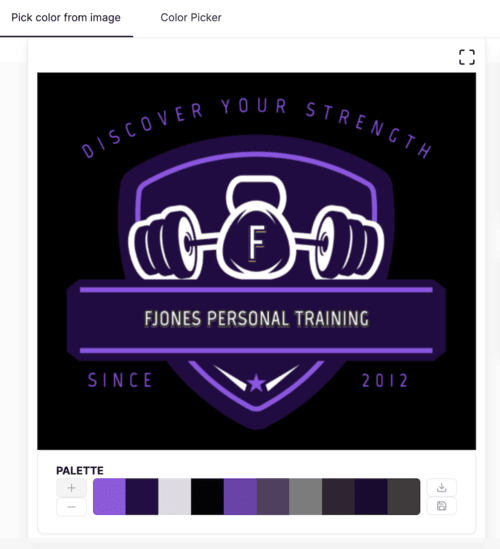
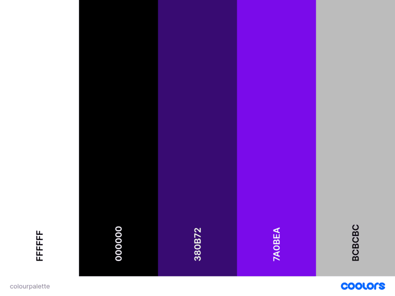
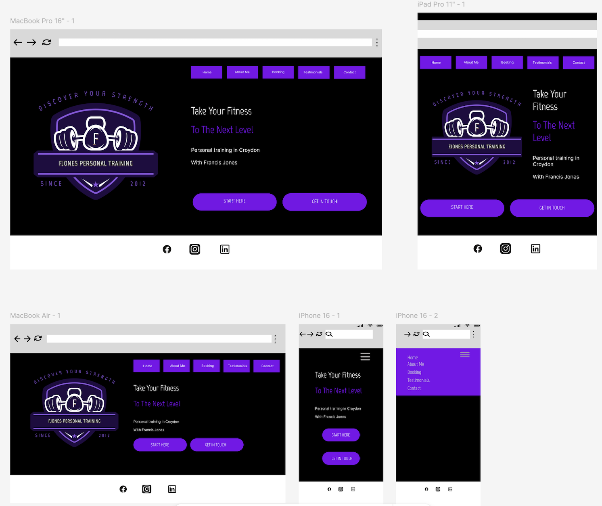
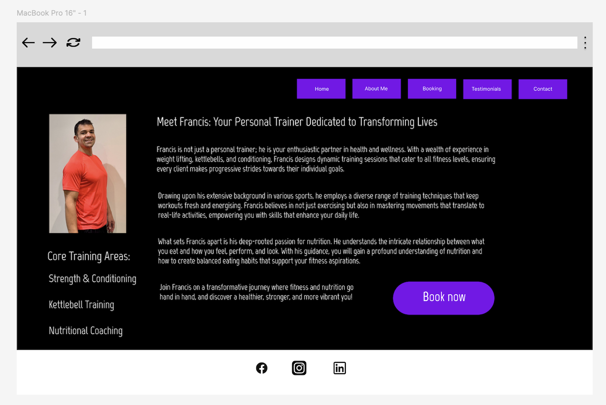
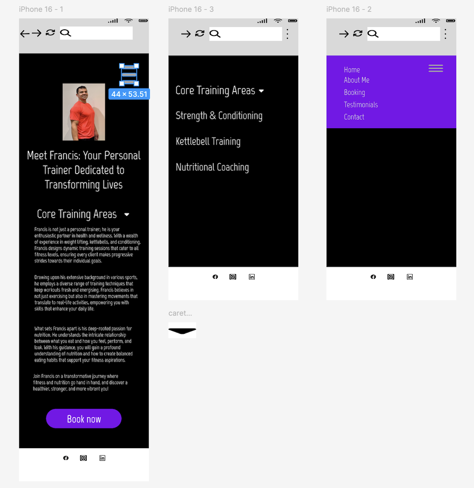
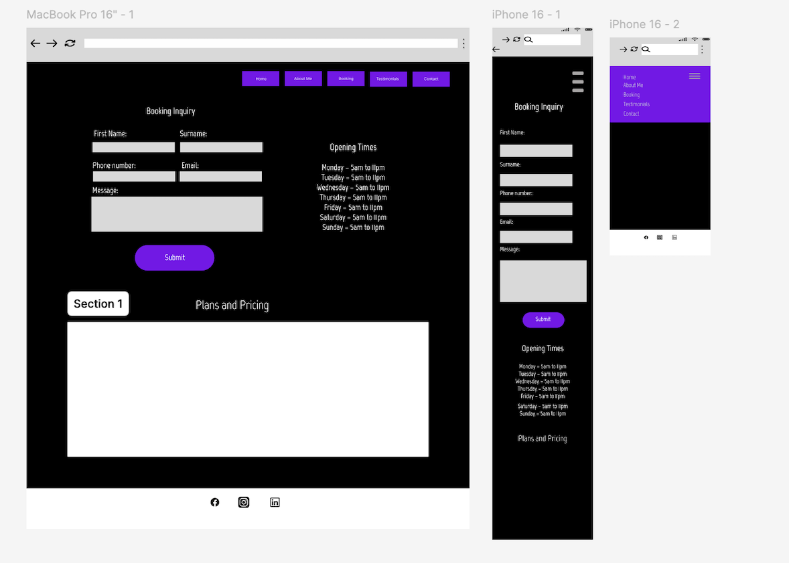
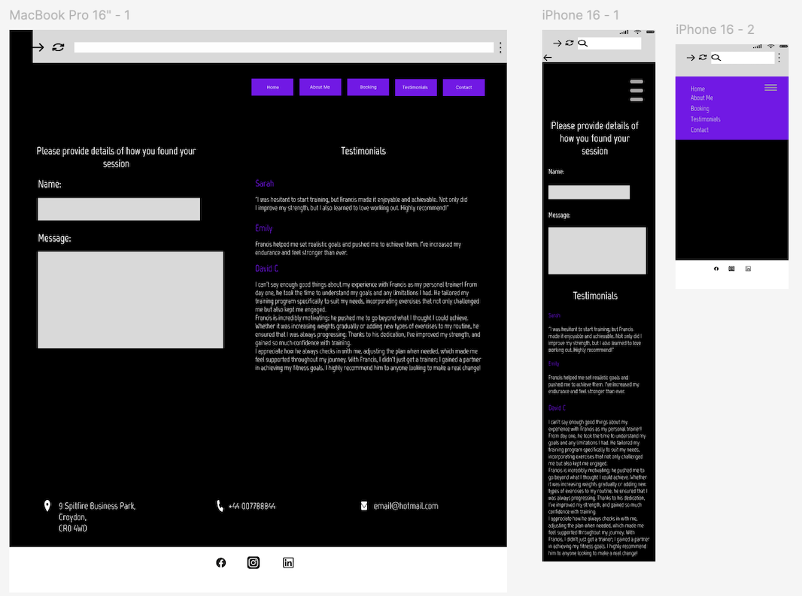
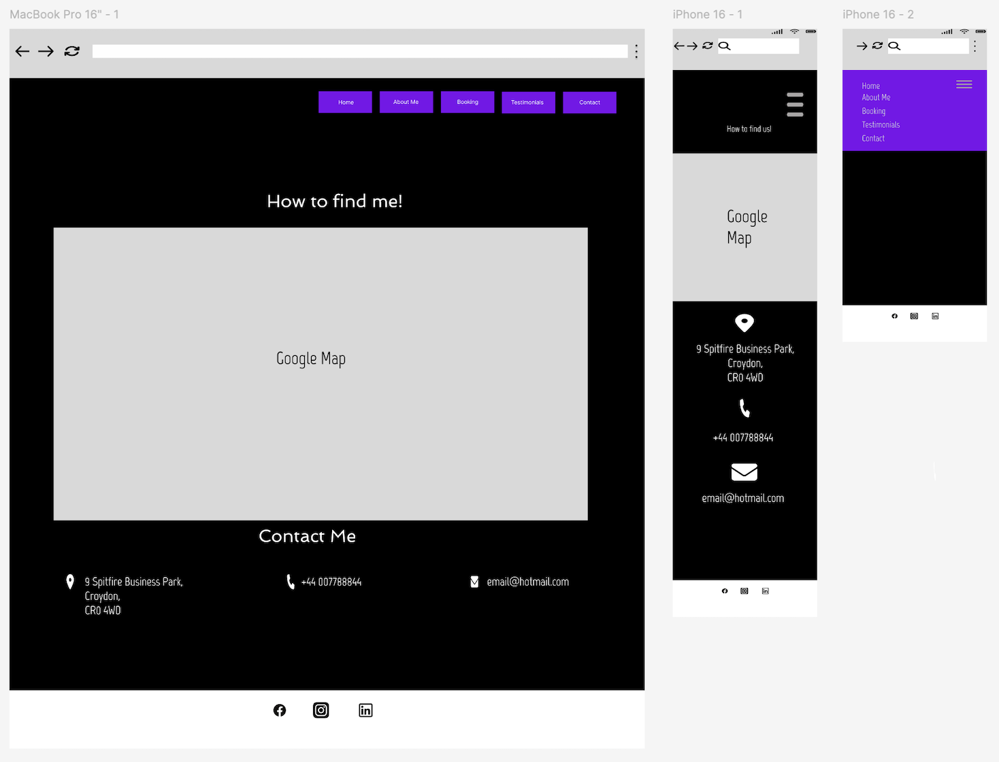

# FJones Personal training

## Introduction

The primary goal of this webpage is to serve as a platform for my friend's business. Currently, my friend does not have a website and relies on word-of-mouth to build his client base. This site aims to offer an engaging and informative introduction to his experience, training philosophy and what he can offer. It will also provide details about one-on-one training sessions, group training, nutritional guidance and customised workout plans. Additionally, the webpage will feature a booking system and accessible contact options, making it easier for the potential clients to reach out, ask questions, and schedule consultations. This will hopefully bring in new business and target people from any training level that want to improve their strength or fitness.

## CONTENTS
[User Experience]
[User Stories]

[Features]

[Design]
* Colour scheme
* Typography
* Wireframes

## User Experience (UX)

### User Stories

#### First Time Visitor Goals

* I want to be able to learn about the personal trainers experience and what they offer so that i can assess their expertise and find the right trainer for me.
* I want to view testimonials to gauge the effectiveness of the personal trainer.
* I want to see a list of availiable services and pricing to work out my budget.
* I want to be able to view the trainers social media links to learn more about their sessions and training philosophy.
* I want a user-friendly layout so i can find information quickly and is responsive to different screen sizes.

#### Returning Visitor Goals

* Upon returning to the site i would like access to workout and nutrition plans.
* I would like to be able to book a session and contact the trainer.

#### Frequent Visitor Goals

* I would like to be able to rechedule my bookings online and be able to do this quickly without having to navigate through many pages.
* I want to access a schedule overview to check upcoming sessions at a glace.
* I would like to have access to personalised feedback from sessions.

#### Owner Goals

* To increase the number of new clients and retension of existing clients by offering online services that are accessable and easy to use from any device.
* To increase awareness of his brand by establishing a strong online presence by increasing visibility on search engines that will highlight his experience.
* The webpage will make administrive tasks easier by using an automated system that will organise time slots from his clients and make it easier to track payments as currently uses a paper diary to record this.

## Design

### Colour Scheme

I used a colour image picker to select colours from the logo, ensuring consistent colour usage across the webpage. To create visually appealing design, i chose a dark background, accented with purple to highlight specific elements. The use of purple can help reinforce brand identity and can make key components stand out to engage users. Initially i created a logo for the website, however i made a conscious descision that actual images of the trainer would be more engaging and add familiarity for the users. Therefore, despite this the colours stayed consistent throughout the webpages with CSS variables used to make it easier to change in the future.  

I have used the following Hex colours:

 #ffffff;
 #000000;
 #380b72;
 #7A0BEA;
 #bcbcbc;

### Typography

I have used google fonts to import fonts.

The primary font that was used for the h1 headings was Marvel font. From my research of fonts i felt this looked sharp and had modern feel to it and preferred this to other fonts. An advantage to using this font is that is a sans serif typeface making it more legible.

I used Montserrat as my secondary font. I researched on google good fonts for readability and consciously decided this was the most appealing font to go along side the marvel font.

### Wireframes

Wireframes were created for desktops, tablet and mobile using figma.

### Home page (index.html)

### Aboutme page (aboutme.html)

### Booking page (booking.html)

### Testimonials page (testimonial.html)

### Contact page (contact.html)

## Features

The website is designed to offer a seamless experience through the following pages:

* Home Page: This is the starting point where new clients or existing clients can have an overview of what the trainer offers and availiability. 

* About Me Page: This page gives a deeper dive into the trainers expereince and why the user should choose his services.

* Booking Page: This page has been developed for enquires and to send a date and time the user would like to book an appointment.

* Contact Page: This page was developed for the user to reach out for any enquiries.

* Booking confirmation pages: This was developed for the booking form and feedback form to indicate to the user that their request has been submitted. 

* Error 404 page: This was added incase the page is not able to load or has been deleted and sends the user back to the homepage.

All pages have a favicon item, title of 'Francis Jones Personal Training' and a h1 element of 'Francis Jones Fitness' that links every page with an anchor element back to the home page. There is a navigation bar and footer on each page that includes anchor elements.

* Favicon and title

* Navigation bar

* Footer

* Home page
headings
columns
carousel
table
cards

* About me page
span elements
image

* Booking and testimonial pages
forms
container for testimonials page
background image
date picker (copied from geeksforgeeks.org)
star rating (W3schools)
booking success pages - Opacity (W3schools)
booking validation for white space validator (stackoverflow.com)

* Contact
embedded Google maps (researched on google and found option to embed code into my work as the url link was blocked)
container for contact details

* Buttons (Bootstrap 5)

scroll bar (copied from W3schools)

* Hover (CSS Pseudo-classes on W3schools)

CSS variables (Boardwalk games and W3schools)

* Error 404 page (udacity.com)