# F Jones Personal Training - Testing

## Contents

### Automated testing
- Lighthouse

### Results from Lighthouse testing

#### Homepage

#### About me page

#### Booking page

#### Testimonials page

#### Contact us page

#### Error 404 page

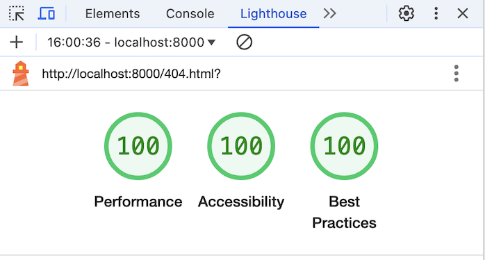

#### Booking success page

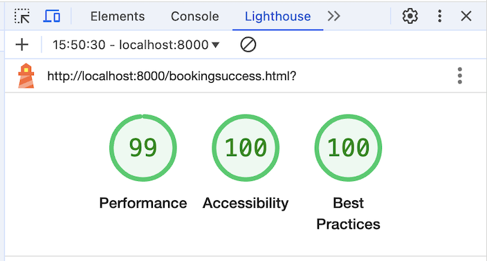

#### Feedback success page

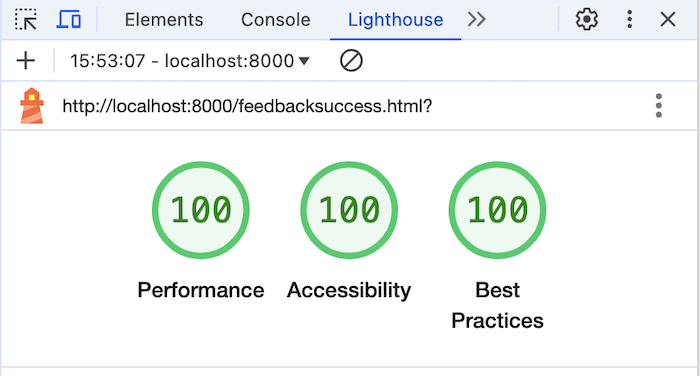

### Results W3C HTML validator

##### Homepage - W3C Validation Check
There were 22 errors identified, which were corrected as follows:
1. Added div to container due to the container tag not being closed.
2. Changed duplicate id attributes to class.
3. Removed multiple <tr> without any cells.

After the above changes the validation passed. Please see homepage validation errors below:

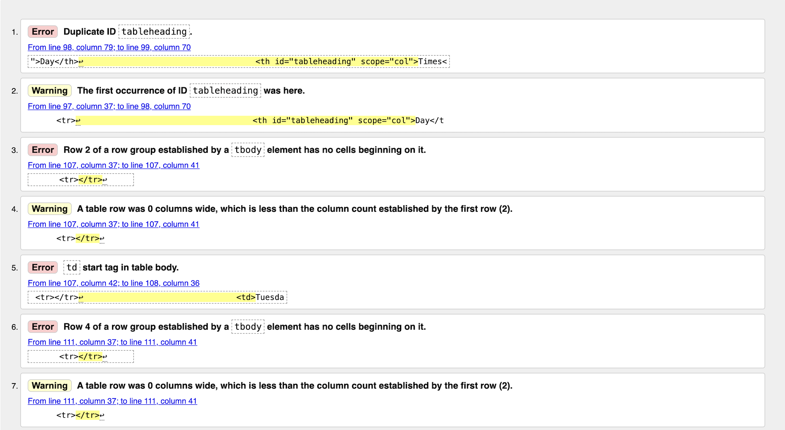
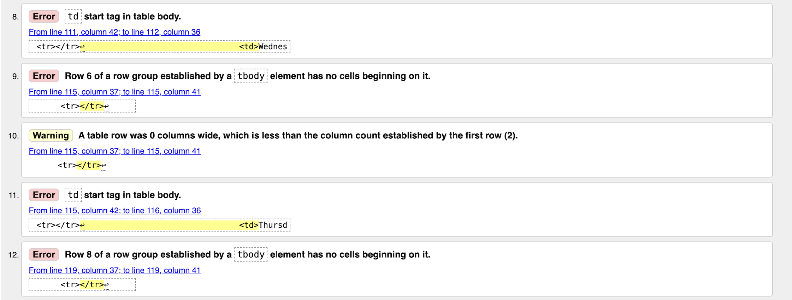
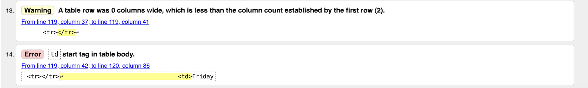
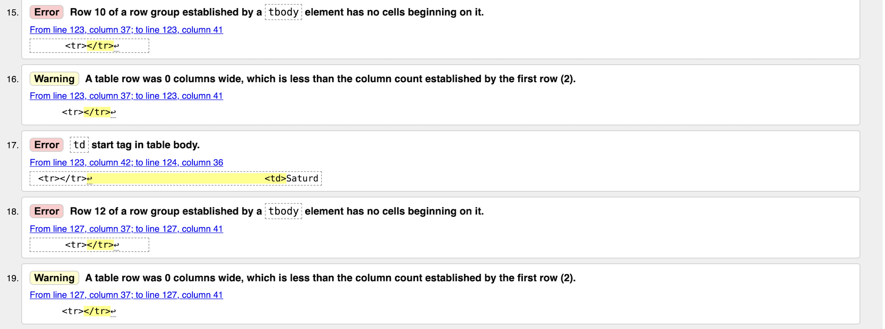
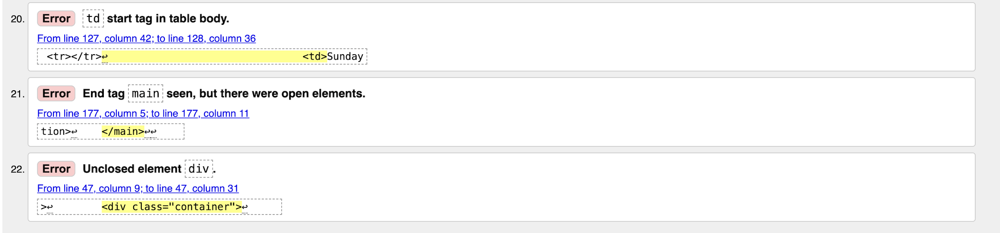

##### About me page - W3C Validation Check
There were 2 errors identified, which were corrected as follows:
1. Added div element to container as the tag was not closed.

After the above changes the validation passed. Please see homepage validation errors below:

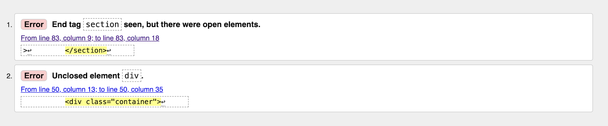

##### Booking page - W3C Validation Check
There were 7 errors identified, which were corrected as follows:
1. Added missing div element that needed a closing tag.

After the above changes the validation passed. Please see homepage validation errors below:

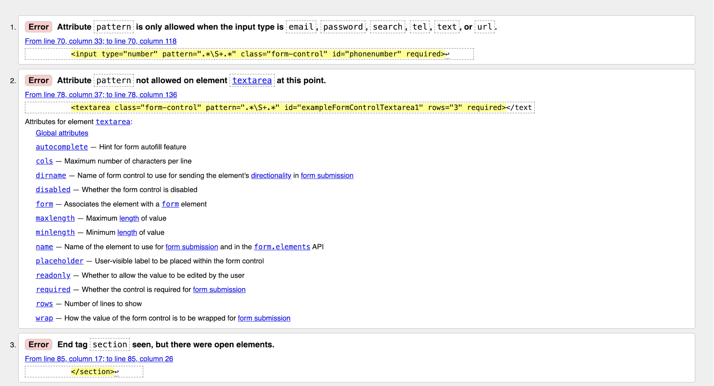
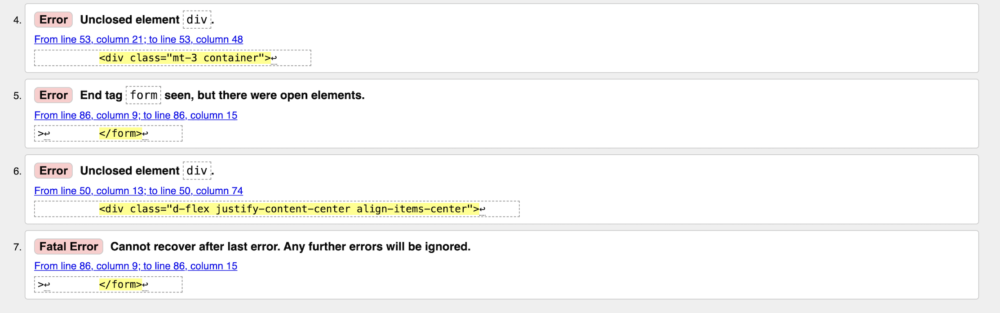

##### Testimonials page - W3C Validation Check
There were 4 errors identified, which were corrected as follows:
1. Added missing div element that needed a closing tag.
2. Removed white space validator from text area.

##### Contact page - W3C Validation Check