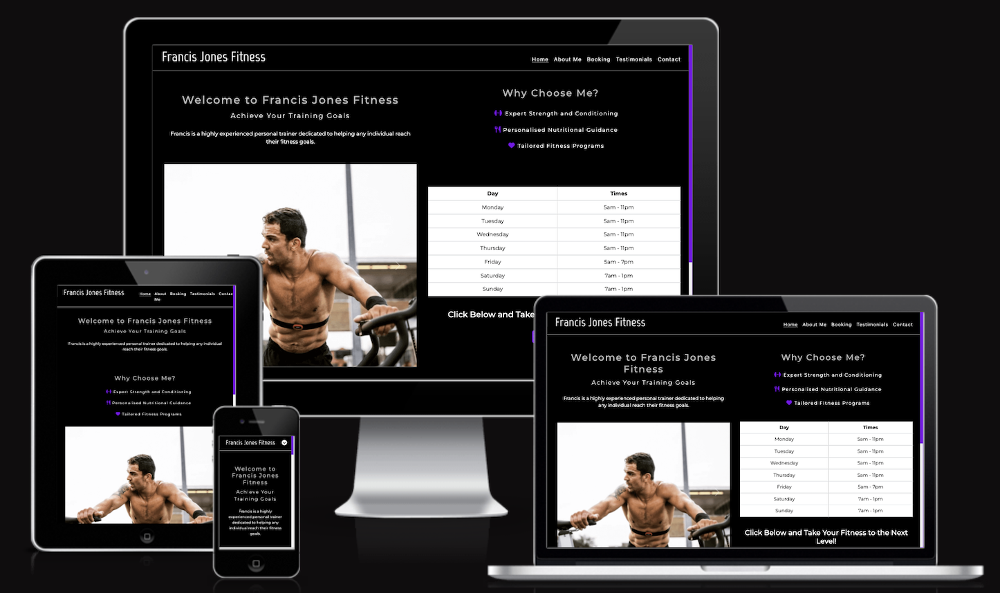
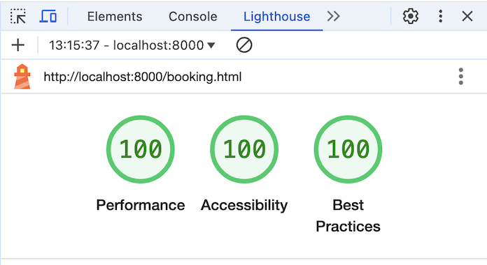
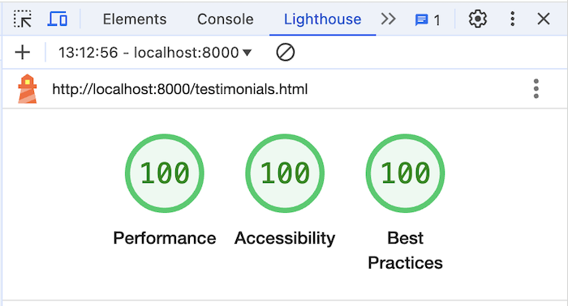

# F Jones Personal Training - Testing

## Contents

### Automated testing
* [Lighthouse](#results-from-lighthouse-testing)
* [W3C HTML and CSS Validator](#results_w3c_html_and_css_validator)
* [Manual Testing](#manual-testing)

### Results from Lighthouse testing

#### Homepage desktop

#### About me page desktop

#### Booking page desktop

#### Testimonials page desktop

#### Contact us page desktop

#### Error 404 page desktop

#### Booking success page desktop

#### Feedback success page desktop

#### Identified Issues on Lighthouse and Fixes

##### Homepage

1. Image Resolution (Performance - 97%)
The first image on the carousel could have had a better resolution to improve the best practice score. However, this image was provided by the trainer, and I was unable to obtain a higher-resolution version thus not fixing this issue.

2. List with Icons (Accessibility - 94%)
There were line break affecting the screen reader accessibility, therefore i adjusted this by removing the line breaks and adding padding around these elements.

3. Heading Hierarchy (Accessibility - 94%)
The heading strcuture for the Core Training Areas section was incorrect. I changed these elements from h2 to h4 to follow the correct order.

The overall outcome after fixes were 100% Best Practice, 100% Accessibility and 97% Performance.

##### About me page

1. Cumulative Layout Shift (CLS) Issue
This page had a CLS of 0.134s, exceeding the recomended 0.1s. The following fixes were attempted:
I reduced the word count on the h2 element that lowered the CLS to 0.127s. I then moved the H2 element above the section container and further reduced this to 0.113s. I finally edited the paragrpah content that was still highlighting an issue. Despite this the CLS remained unchanged at 0.113s. 

The CLS issue persisted due to an unknown cause related to the paragraph 'what sets Francis apart is his deep-rooted passion for nutrition'. While different solutions were tested, the exact reason for this paragraph contributing to the CLS could not be identified. Therefore, further investigation is needed to find the root cause. 

2. Heading Hierarchy (Accessibility - 98%)
The heading strcuture for the Core Training Areas section was incorrect. I changed these elements from h2 to h4 to follow the correct order.

The overall outcome after fixes were 100% Best Practice, 100% Accessibility and 94% Performance.

##### Booking page

This page had 100% on Best Practice, Accessibility and Performance.

##### Testimonials page

1. Heading Hierarchy (Accessibility - 98%)
The heading strucuture did not follow a semantic order, which lowered the accessibility. The title 'Testimonials' was originally an h2 element, but changing it to an h3 element corrected the strucuture.

The overall outcome after fixes were 100% Best Practice, 100% Accessibility and 100% Performance.

##### Contact us page

1. Missing Title for iframe (Accessibility - 95%)
The iframe was missing a title attribute, which negatively, impacted accessibility. Adding a descriptive title improved accessibility score.

2. Embedded Google Maps (Best Practices - 78%)
The use of an embedded Google maps resulted in 13 third-party cookies, lowering the best practice score. Unfortunately, i was unable to use other methods as access was blocked by google.

The overall outcome after fixes were 78% Best Practice, 100% Accessibility and 100% Performance.

##### 404 page

This page had 100% on Best Practice, Accessibility and Performance.

Booking success page
1. Missing meta name, charset declaration and html doctype detailed in lighthouse. However, on inspection this error was due to the <!DOCTYPE html> tag missing a <. Also another issue was Unused code due to font awesoe that was removed. (Best Practices - 89% ).  

The overall outcome after fixes were 100% Best Practice, 100% Accessibility and 99% Performance.

Feedback success page

This page had 100% on Best Practice, Accessibility and Performance.

[Back to Top](#contents)

### Results_W3C_HTML_and_CSS_validator

##### Homepage_Validator - W3C Validation Check
There were 22 errors identified, which were corrected as follows:
1. Added div to container due to the container tag not being closed.
2. Changed duplicate id attributes to class.
3. Removed multiple <tr> without any cells.

After the above changes the validation passed. Please see homepage validation errors below:

##### About me page - W3C Validation Check
There were 2 errors identified, which were corrected as follows:
1. Added div element to container as the tag was not closed.

After the above changes the validation passed. Please see about me validation errors below:

##### Booking page - W3C Validation Check
There were 7 errors identified, which were corrected as follows:
1. Added missing div element that needed a closing tag.

After the above changes the validation passed. Please see booking page validation errors below:

##### Testimonials page - W3C Validation Check
There were 4 errors identified, which were corrected as follows:
1. Added missing div element that needed a closing tag.
2. Removed white space validator from text area.

After the above changes the validation passed. Please see testimonial page validation errors below:

##### Contact page - W3C Validation Check
There were 2 errors identified, which were corrected as follows:
1. Previous syntax of 'width="100%' was invalid. Changed width to 600 and added style width: 100%.
2. Height of iframe changed from auto to 450 as invalid due to expecting a digit value.

After the above changes the validation passed. Please see contact page validation errors below:

##### booking and feedback success page - W3C Validation Check
Both pages passed validation.

##### 404 page - W3C Validation Check
There were 2 errors identified, which were corrected as follows:
1. There was a main element inside another main element. Removed additional main element.

After the above changes the validation passed. Please see 404 page validation errors below:

#### CSS validator
No errors were found with the css code on validation checks.

[Back to Top](#contents)

### Manual Testing

Home page testing
| Feature | Testing Performed | Result | Pass/Fail |
| --- | --- | --- | --- |
| Site title | Hover over navbar | Changes colour on hover | Pass |
| Navbar home button | Hover over navbar | Changes colour on hover with home underlined to show user the page they are on | Pass |
| Navbar about me button | Hover over navbar and click | Changes colour on hover and takes user to about me page | Pass |
| Navbar booking button | Hover over navbar and click  | Changes colour on hover and takes user to booking page | Pass |
| Navbar tesimonials button | Hover over navbar and click  | Changes colour on hover and takes user to testimonials page | Pass |
| Navbar contact button| Hover over navbar and click  | Changes colour on hover and takes user to contact page | Pass |
| Navbar button drop down | Change screen size to mobile | Navbar turns into a drop down icon on mobile devices and smaller | Pass |
| Day and Time table | Hover over table list | table rows highlight grey on hover  | Pass |
| Book now button | Click button | redirects user to booking page | Pass |
| Footer icons | Click each footer icon | Hover effect on each icon and when clicked takes the client to the appropriate link | Pass |
| Carousel next and previous buttons | Click on next and previous button on the automatic carousel  | Slides to next image | Pass |

About me page testing
| Feature | Testing Performed | Result | Pass/Fail |
| --- | --- | --- | --- |
| Site title | Hover over navbar and click on title | Changes colour on hover and takes the client to the home page when clicked on | Pass |
| Navbar home button | Hover over navbar | Changes colour on hover with home underlined to show user the page they are on | Pass |
| Navbar about me button | Hover over navbar and click | Changes colour on hover and takes user to about me page | Pass |
| Navbar booking button | Hover over navbar and click  | Changes colour on hover and takes user to booking page | Pass |
| Navbar tesimonials button | Hover over navbar and click  | Changes colour on hover and takes user to testimonials page | Pass |
| Navbar contact button| Hover over navbar and click  | Changes colour on hover and takes user to contact page | Pass |
| Navbar button drop down | Change screen size to mobile | Navbar turns into a drop down icon on mobile devices and smaller | Pass |
| Footer icons | Click each footer icon | Hover effect on each icon and when clicked takes the client to the appropriate link | Pass |
| Book now button | Click button | redirects user to booking page | Pass |
| Get in Touch button | Click button | redirects user to contact page | Pass |

Booking page testing
| Feature | Testing Performed | Result | Pass/Fail |
| --- | --- | --- | --- |
| Site title | Hover over navbar | Changes colour on hover | Pass |
| Navbar home button | Hover over navbar | Changes colour on hover with home underlined to show user the page they are on | Pass |
| Navbar about me button | Hover over navbar and click | Changes colour on hover and takes user to about me page | Pass |
| Navbar booking button | Hover over navbar and click  | Changes colour on hover and takes user to booking page | Pass |
| Navbar tesimonials button | Hover over navbar and click  | Changes colour on hover and takes user to testimonials page | Pass |
| Navbar contact button| Hover over navbar and click  | Changes colour on hover and takes user to contact page | Pass |
| Navbar button drop down | Change screen size to mobile | Navbar turns into a drop down icon on mobile devices and smaller | Pass |
| Footer icons | Click each footer icon | Hover effect on each icon and when clicked takes the client to the appropriate link | Pass |
| First name input field | Add white space and then no text into field | Message appears to fill in field on submit or match the format request if white space | Pass |
| Surname name input field | Add white space and then no text into field | Message appears to fill in field on submit or match the format request if white space | Pass |
| Email input field | Add white space and then text without @ into field | Message appears to include '@' in email address on submit or fill in this page if white space | Pass |
| Phone number input field |Add white space and then no text into field | Message appears to fill in field on submit | Pass |
| Date and time input field | Inserted date and time | Date and time shown after using calendar | Pass |
| Message input field | No text added | Message appears to fill in field on submit | Pass |
| Submit button | Click button | redirects user to booking success page | Pass |

Testimonials page testing
| Feature | Testing Performed | Result | Pass/Fail |
| --- | --- | --- | --- |
| Site title | Hover over navbar | Changes colour on hover | Pass |
| Navbar home button | Hover over navbar | Changes colour on hover with home underlined to show user the page they are on | Pass |
| Navbar about me button | Hover over navbar and click | Changes colour on hover and takes user to about me page | Pass |
| Navbar booking button | Hover over navbar and click  | Changes colour on hover and takes user to booking page | Pass |
| Navbar tesimonials button | Hover over navbar and click  | Changes colour on hover and takes user to testimonials page | Pass |
| Navbar contact button| Hover over navbar and click  | Changes colour on hover and takes user to contact page | Pass |
| Navbar button drop down | Change screen size to mobile | Navbar turns into a drop down icon on mobile devices and smaller | Pass |
| Footer icons | Click each footer icon | Hover effect on each icon and when clicked takes the client to the appropriate link | Pass |
| Name input field | Add white space and then no text into field | Message appears to fill in field on submit or match the format request if white space | Pass |
| Message input field | No text added | Message appears to fill in field on submit | Pass |
| Submit button | Click button | redirects user to feedback success page | Pass |

Contact page testing
| Feature | Testing Performed | Result | Pass/Fail |
| --- | --- | --- | --- |
| Site title | Hover over navbar | Changes colour on hover | Pass |
| Navbar home button | Hover over navbar | Changes colour on hover with home underlined to show user the page they are on | Pass |
| Navbar about me button | Hover over navbar and click | Changes colour on hover and takes user to about me page | Pass |
| Navbar booking button | Hover over navbar and click  | Changes colour on hover and takes user to booking page | Pass |
| Navbar tesimonials button | Hover over navbar and click  | Changes colour on hover and takes user to testimonials page | Pass |
| Navbar contact button| Hover over navbar and click  | Changes colour on hover and takes user to contact page | Pass |
| Navbar button drop down | Change screen size to mobile | Navbar turns into a drop down icon on mobile devices and smaller | Pass |
| Contact me icons | Click each icon | Hover effect on each icon | Pass |
| Footer icons | Click each footer icon | Hover effect on each icon and when clicked takes the client to the appropriate link | Pass |
| Map | Click on map and move the map by holiding right click | Able to zoon in and out of map and move map within the iframe | Pass |

Booking success page testing
| Feature | Testing Performed | Result | Pass/Fail |
| --- | --- | --- | --- |
| Site title | Hover over navbar | Changes colour on hover | Pass |
| Navbar home button | Hover over navbar | Changes colour on hover with home underlined to show user the page they are on | Pass |
| Navbar about me button | Hover over navbar and click | Changes colour on hover and takes user to about me page | Pass |
| Navbar booking button | Hover over navbar and click  | Changes colour on hover and takes user to booking page | Pass |
| Navbar tesimonials button | Hover over navbar and click  | Changes colour on hover and takes user to testimonials page | Pass |
| Navbar contact button| Hover over navbar and click  | Changes colour on hover and takes user to contact page | Pass |
| Navbar button drop down | Change screen size to mobile | Navbar turns into a drop down icon on mobile devices and smaller | Pass |
| Return home button | Click button | redirects user to home page | Pass |

Feedback success page testing
| Feature | Testing Performed | Result | Pass/Fail |
| --- | --- | --- | --- |
| Site title | Hover over navbar | Changes colour on hover | Pass |
| Navbar home button | Hover over navbar | Changes colour on hover with home underlined to show user the page they are on | Pass |
| Navbar about me button | Hover over navbar and click | Changes colour on hover and takes user to about me page | Pass |
| Navbar booking button | Hover over navbar and click  | Changes colour on hover and takes user to booking page | Pass |
| Navbar tesimonials button | Hover over navbar and click  | Changes colour on hover and takes user to testimonials page | Pass |
| Navbar contact button| Hover over navbar and click  | Changes colour on hover and takes user to contact page | Pass |
| Navbar button drop down | Change screen size to mobile | Navbar turns into a drop down icon on mobile devices and smaller | Pass |
| Return home button | Click button | redirects user to home page | Pass |

404 page testing
| Feature | Testing Performed | Result | Pass/Fail |
| --- | --- | --- | --- |
| Return home button | Click button | redirects user to home page | Pass |

[Back to Top](#contents)